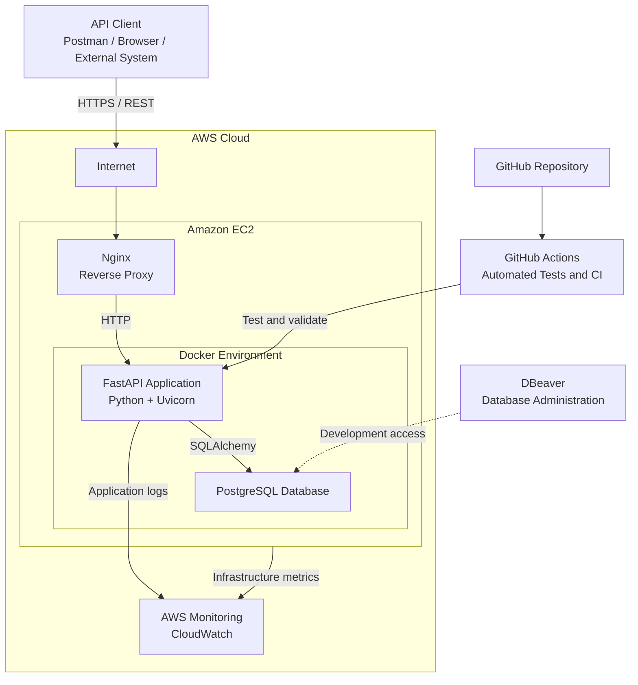
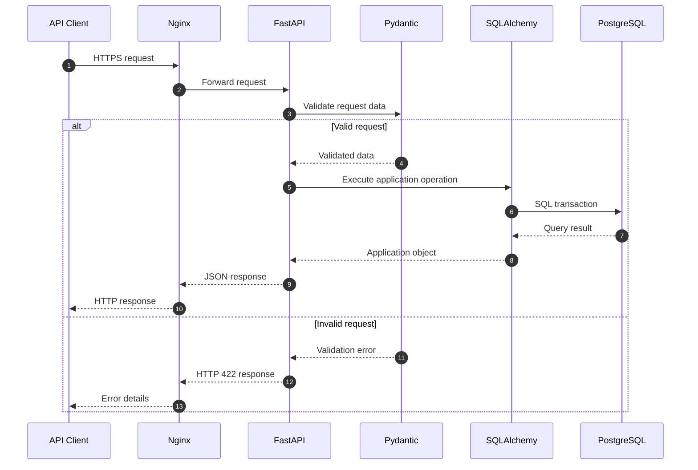
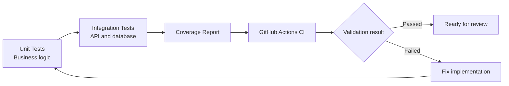

# Backend Engineering Lab


A hands-on backend engineering portfolio focused on building, testing, containerizing, and deploying REST APIs with **Python, FastAPI, PostgreSQL, Docker, and AWS**.

The repository follows a progressive laboratory structure in which each stage introduces practical backend development concepts and brings the application closer to a production-inspired environment.

---

## Project Purpose

This repository was created to demonstrate practical backend engineering skills through a sequence of independent but connected laboratories.

The project focuses on technologies and workflows commonly found in junior backend development and cloud-oriented roles, including:

- REST API development with Python and FastAPI
- Data validation with Pydantic
- Relational databases with PostgreSQL
- Database management using DBeaver
- Object-Relational Mapping with SQLAlchemy
- Database migrations with Alembic
- Authentication and authorization
- Automated testing with Pytest
- Containerization with Docker
- Multi-container environments with Docker Compose
- Continuous Integration with GitHub Actions
- Performance testing
- Deployment on AWS

---

## Architecture Overview

The final architecture developed throughout the laboratories will follow this general structure:



> The complete architecture will be introduced progressively. Initial laboratories run locally, while later stages add containers, automation, and AWS deployment.

---

## Request Flow

A typical request handled by the final application will follow this path:



---

## Learning Path

The repository is organized into twelve progressive laboratories.

| LAB | Topic | Main Skills |
|:---:|---|---|
| 01 | FastAPI Basics | REST endpoints, OpenAPI, Pydantic and project structure |
| 02 | PostgreSQL with DBeaver | Relational databases, SQL and database administration |
| 03 | SQLAlchemy ORM | Models, sessions and database abstraction |
| 04 | CRUD API | Create, read, update and delete operations |
| 05 | JWT Authentication | Registration, login, tokens and protected endpoints |
| 06 | Alembic | Database migrations and schema versioning |
| 07 | Docker | Application images and container execution |
| 08 | Docker Compose | FastAPI and PostgreSQL multi-container environment |
| 09 | Automated Testing | Unit tests, integration tests and coverage |
| 10 | GitHub Actions CI | Automated validation, linting and testing |
| 11 | API Performance Testing | Load tests, response times and bottleneck analysis |
| 12 | AWS Deployment | EC2, Nginx, HTTPS, containers and monitoring |

For the complete description and current progress, see the [project roadmap](ROADMAP.md).

---

## Repository Structure

The expected repository structure is:

```text
backend-engineering-lab/
│
├── 01-fastapi-basics/
│   ├── app/
│   ├── tests/
│   └── README.md
│
├── 02-postgresql-with-dbeaver/
│   ├── sql/
│   ├── resources/
│   └── README.md
│
├── 03-sqlalchemy-orm/
│   ├── app/
│   ├── tests/
│   └── README.md
│
├── 04-crud-api/
├── 05-jwt-authentication/
├── 06-alembic-migrations/
├── 07-docker/
├── 08-docker-compose/
├── 09-automated-testing/
├── 10-github-actions-ci/
├── 11-api-performance-testing/
├── 12-aws-deployment/
│
├── .github/
│   └── workflows/
│
├── .gitignore
├── LICENSE
├── README.md
└── ROADMAP.md
```

The structure may evolve as the laboratories are implemented.

---

## Technology Stack

### Backend development

- Python
- FastAPI
- Uvicorn
- Pydantic
- REST APIs
- OpenAPI
- Swagger UI

### Database

- PostgreSQL
- SQL
- DBeaver
- SQLAlchemy
- Alembic

### Security

- Password hashing
- JSON Web Tokens
- Authentication
- Basic role-based authorization

### Testing and quality

- Pytest
- Unit tests
- Integration tests
- Code coverage
- Linting
- GitHub Actions

### Containers and deployment

- Docker
- Docker Compose
- Nginx
- Amazon EC2
- Amazon CloudWatch

### Development tools

- Git
- GitHub
- Visual Studio Code
- Postman

---

## Laboratory Methodology

Each laboratory follows a practical and repeatable structure:

1. **Objective** — What the laboratory demonstrates.
2. **Architecture** — Components and communication flow.
3. **Prerequisites** — Required knowledge and tools.
4. **Implementation** — Step-by-step technical development.
5. **Verification** — Commands and tests used to validate the result.
6. **Troubleshooting** — Common issues and possible solutions.
7. **Cleanup** — Removal of temporary or cloud resources when applicable.
8. **Lessons Learned** — Technical conclusions and skills demonstrated.

---

## API Development Principles

The laboratories progressively apply the following principles:

- Clear separation of responsibilities
- Type-safe request and response models
- Consistent HTTP status codes
- Centralized exception handling
- Environment-based configuration
- Secure handling of credentials
- Reusable database sessions
- Version-controlled database migrations
- Automated tests
- Reproducible development environments
- Documented API behavior
- Observable application execution

---

## Security Practices

This repository does not store real credentials or sensitive information.

Environment-specific values must be stored in local environment files:

```text
.env
```

A safe template may be committed as:

```text
.env.example
```

Typical variables include:

```env
DATABASE_HOST=localhost
DATABASE_PORT=5432
DATABASE_NAME=backend_lab
DATABASE_USER=backend_user
DATABASE_PASSWORD=replace_with_local_password

SECRET_KEY=replace_with_secure_secret
ACCESS_TOKEN_EXPIRE_MINUTES=30
```

> Real `.env` files, private keys, passwords, tokens, and cloud credentials must never be committed to Git.

---

## Planned API Capabilities

As the project evolves, the API will include:

- Health and version endpoints
- Resource creation and retrieval
- Resource updates and deletion
- Pagination
- Filtering
- Data validation
- PostgreSQL persistence
- User registration
- Authentication
- Protected endpoints
- Basic authorization
- Automated tests
- OpenAPI documentation
- Containerized execution
- AWS deployment

---

## Testing Strategy

The repository will use multiple testing levels:



The testing process will validate:

- Business rules
- Request validation
- HTTP responses
- Error scenarios
- Database operations
- Authentication behavior
- Integration between application components

---

## Continuous Integration

GitHub Actions will be introduced to automatically execute quality checks when code is pushed or submitted through a Pull Request.

The planned CI workflow includes:

```text
Install dependencies
        ↓
Run linting
        ↓
Run unit tests
        ↓
Run integration tests
        ↓
Generate coverage report
        ↓
Validate application build
```

---

## Current Status

The repository is currently under active development.

| Area | Status |
|---|---|
| Repository planning | ✅ Completed |
| Roadmap | ✅ Completed |
| Architecture definition | ✅ Completed |
| FastAPI fundamentals | ⏳ Planned |
| PostgreSQL integration | ⏳ Planned |
| Automated testing | ⏳ Planned |
| Docker environment | ⏳ Planned |
| Continuous Integration | ⏳ Planned |
| AWS deployment | ⏳ Planned |

---

## Portfolio Objectives

This repository is designed to demonstrate practical capabilities relevant to:

- Junior Python Backend Developer
- Junior FastAPI Developer
- Junior API Developer
- Junior Cloud Developer
- Entry-level DevOps opportunities
- AWS-oriented freelance projects
- Backend API deployment projects
- Technical documentation projects

The focus is not only on application code, but also on the complete engineering workflow required to develop, test, document, package, and deploy a backend service.

---

## Roadmap

Detailed laboratory scope, planned technologies, and implementation progress are available in:

- [ROADMAP.md](ROADMAP.md)

---

## Author

**Itamar de Sá Britto Júnior**

Computer Engineering student focused on:

- Backend Engineering
- Cloud Computing
- AWS
- APIs
- DevOps
- Observability
- Site Reliability Engineering

GitHub: [@itamarsb](https://github.com/itamarsb)

---

## License

This project is licensed under the [MIT License](LICENSE).
